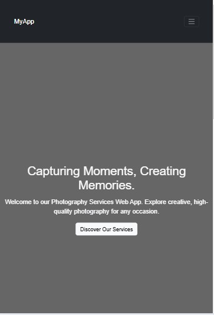
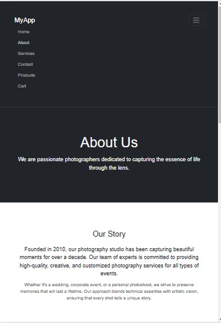
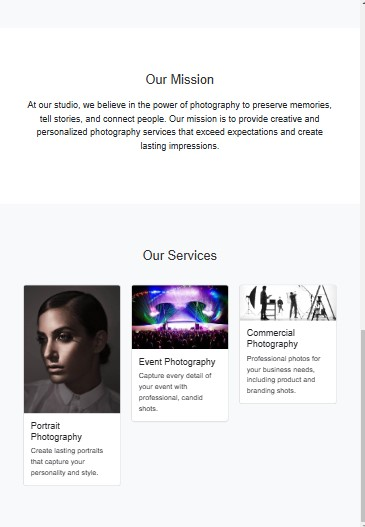
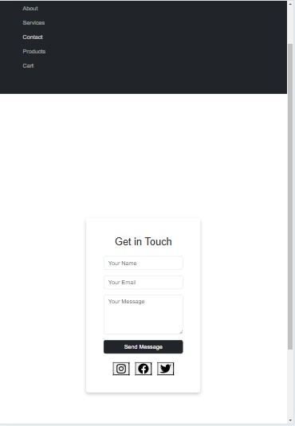
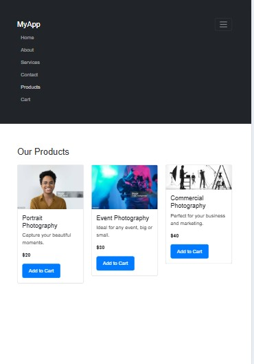
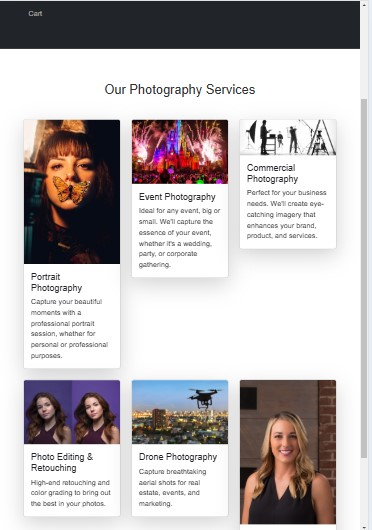

# 📸 Photography Services Web App

## 🌟 Project Description

The **Photography Services Web App** is a modern and responsive platform designed for photographers to showcase their portfolios, manage bookings, and engage with potential clients. Users can explore beautiful photo galleries, schedule photography sessions, and contact the photographer effortlessly.

## 🚀 Live Demo

[View the Live App](#) _(Deployment in progress...)_

## 🛠 Tech Stack

- **React (TSX)** – Frontend framework
- **TypeScript** – Type safety and maintainability
- **Bootstrap & Tailwind CSS** – Modern styling
- **React Router** – Navigation handling

## ✨ Features

✅ **Photo Gallery** – Browse high-quality images  
✅ **Booking System** – Schedule photography sessions  
✅ **Contact Form** – Get in touch with the photographer  
✅ **Responsive Design** – Works on all devices  
✅ **Dark Mode Toggle** – Switch between light and dark themes

## 🖼 Screenshots

Here are some previews of the web app:

## 🖼 Screenshots

Here are some previews of the Photography Services Web App:

## 🖼 Screenshots

Here are some previews of the Photography Services Web App:

### 📌 Home Page



### 📌 About Us Page

  
  


### 📌 Contact Page



### 📌 Product Page



### 📌 Services Page



## 🔧 Setup Instructions

1. **Clone the Repository**
   ```bash
   git clone https://github.com/your-username/your-photography-project.git
   cd your-photography-project
   ```
